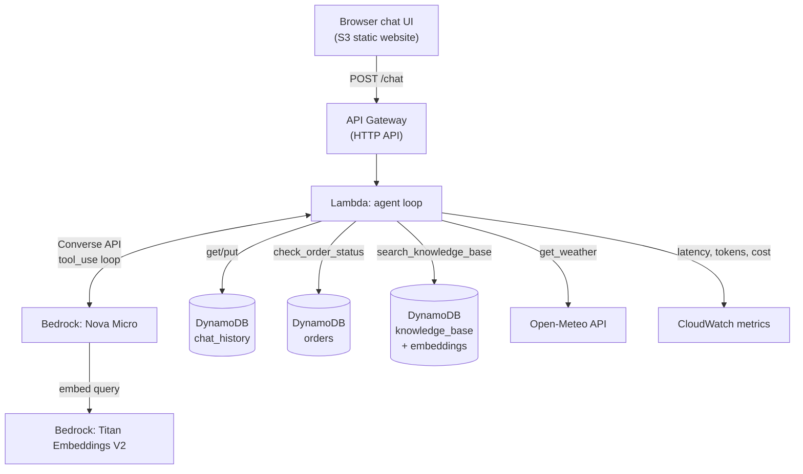

# CloudCart Agent — an agentic AI support bot (Terraform + GitHub Actions)

An AI customer-support agent for a fictional online store, "CloudCart." Unlike
a plain chatbot, this agent **reasons about which tools to use** and calls
them mid-conversation — it can look up real order status, search internal
help documents (RAG), and check the weather to answer shipping-delay
questions. Every request's latency, token usage, and estimated cost are
logged to CloudWatch.

---

Link :http://abhishek-chatbot-frontend-2026.s3-website.eu-north-1.amazonaws.com/

---

## Why this project exists

Most "AI chatbot" demo projects are a thin wrapper around an LLM API call.
This one demonstrates the actual skills behind production agentic systems:

- **Tool use / function calling** — the model decides *when* to call a tool,
  the Lambda executes it, and the result is fed back for the model to reason
  over before answering (a real agent loop, not a single API call)
- **RAG (Retrieval-Augmented Generation)** — answers about policies are
  grounded in real documents via embeddings + similarity search, not just
  the model's general training
- **Observability** — every request's cost and latency is measurable, which
  is the first thing a real deployment needs before anyone trusts it in
  production
- **Infrastructure as Code + CI/CD** — the entire system, including seeding
  the knowledge base, is reproducible from a single `git push`

## Architecture



**Agent loop, concretely:** a user asks "What's the status of my order
ORD-1001, and will the weather delay it?" → Nova Micro decides it needs the
`check_order_status` tool → Lambda executes it against DynamoDB → the result
goes back to the model → the model decides it also needs `get_weather` →
Lambda calls Open-Meteo → result goes back → the model composes a final
answer using both. This is the same pattern used by production agent
frameworks, just written explicitly so the mechanics are visible.

## Stack

- **Amazon Bedrock** (Nova Micro for chat, Titan Embeddings V2 for RAG)
- **Lambda** (Python) — the agent loop and tool execution
- **DynamoDB** — three tables: chat history (memory), knowledge base
  (embeddings for RAG), orders (mock backend for the agent's tool)
- **API Gateway (HTTP API)** — `POST /chat`
- **S3 static website** — browser chat UI
- **CloudWatch** — custom metrics: latency, input/output tokens, estimated cost

## Model access

AWS retired the manual "Model access" page. Serverless models like Amazon
Nova Micro are automatically enabled the first time your account invokes
them. This is cheap, not free — expect well under a dollar for heavy testing.

## Setup

1. **Push this repo to GitHub**, keeping the folder structure intact:
   `.github/workflows/terraform.yml`, `lambda/chatbot.py`, `site/index.html.tpl`,
   `knowledge/docs.txt`, `scripts/*.py`.

2. **IAM user** with permissions for Lambda, DynamoDB, IAM, API Gateway, S3,
   Bedrock, and CloudWatch. `AdministratorAccess` is simplest for learning.

3. **GitHub repo secrets**:
   - `AWS_ACCESS_KEY_ID`
   - `AWS_SECRET_ACCESS_KEY`
   - `FRONTEND_BUCKET_NAME` — globally unique S3 bucket name

4. **Push to `main`.** GitHub Actions will: apply the Terraform, then run
   `scripts/ingest_knowledge_base.py` (embeds `knowledge/docs.txt` into the
   knowledge base table) and `scripts/seed_orders.py` (adds sample orders).

5. Check the **Terraform Apply** log for `chat_endpoint` and `frontend_url`.

## Testing the agent

Try prompts that exercise each tool:

```bash
curl -X POST https://YOUR-ENDPOINT/chat -H "Content-Type: application/json" \
  -d '{"session_id": "t1", "message": "What is the status of order ORD-1001?"}'

curl -X POST https://YOUR-ENDPOINT/chat -H "Content-Type: application/json" \
  -d '{"session_id": "t1", "message": "What is your return policy?"}'

curl -X POST https://YOUR-ENDPOINT/chat -H "Content-Type: application/json" \
  -d '{"session_id": "t1", "message": "Is bad weather likely to delay my delivery to Stockholm?"}'
```

Sample orders available: `ORD-1001` (Shipped), `ORD-1002` (Processing),
`ORD-1003` (Delivered), `ORD-1004` (Delayed - Weather).

## Evaluation harness

`eval/test_bot.py` is a small smoke-test suite — the kind of regression check
you'd run after changing the system prompt, swapping models, or adding tools:

```bash
python eval/test_bot.py https://YOUR-ENDPOINT/chat
```

It checks that order lookups, RAG answers, and plain conversation all still
behave as expected, and exits non-zero if anything regresses.

## Observability

Every request logs to a CloudWatch namespace called `CloudCartAgent`:
`LatencyMs`, `InputTokens`, `OutputTokens`, `EstimatedCostUSD`. In the AWS
Console: CloudWatch → Metrics → All metrics → `CloudCartAgent`. This answers
the question every real deployment eventually gets asked: *"how much does
this cost, and how fast is it?"*

## What I'd do differently for real production use

Being upfront about this is part of the story, not a weakness:

- Swap the DynamoDB-scan RAG for a real vector store (OpenSearch Serverless,
  or Bedrock Knowledge Bases) — fine at a few dozen chunks, not at scale
- Add Bedrock Guardrails for content filtering and PII redaction
- Add an API key or Cognito authorizer — the endpoint is currently open
- Swap long-lived AWS access keys for GitHub OIDC + an IAM role
- Add the eval harness as a CI gate that blocks bad deploys, not just a
  manual script
- Add a TTL to the chat history table so old sessions auto-expire

## Notes

- Costs are pay-per-use across Bedrock, Lambda, DynamoDB, and API Gateway —
  cheap for a demo, but not free.
- Change `session_id` to start a fresh conversation with no prior memory.
